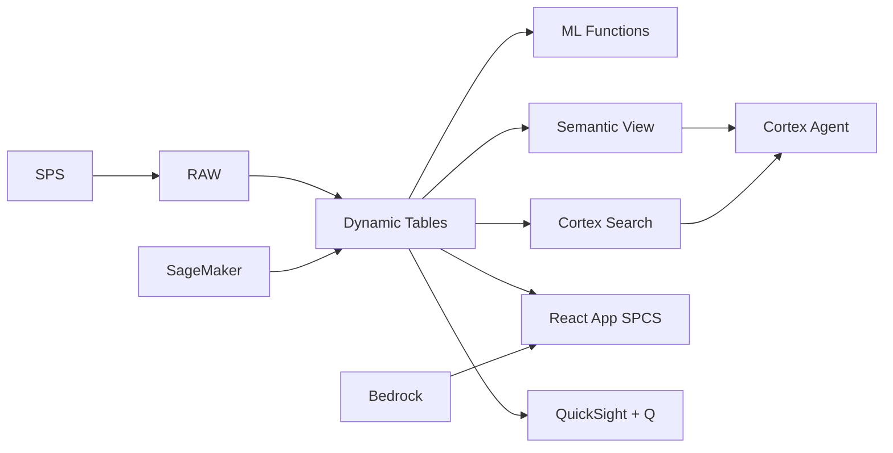

# Nickel Processing Optimization

HPAL and RKEF process optimization for Indonesia's nickel smelters — ML.FORECAST predicts recovery rates, Dynamic Tables build real-time plant dashboards, and Cortex AI generates operator recommendations.

## Architecture

Indonesia's nickel processing plants run HPAL and RKEF technology to convert laterite ore into battery-grade products. With recovery rates varying from 84-92% across lines and energy intensity 12% above benchmark, the VP Processing needs real-time visibility into process performance — and ML-driven recommendations to close the efficiency gap worth Rp 180 billion annually.



## Snowflake Capabilities

| Capability | Implementation |
|-----------|---------------|
| Dynamic Tables | PLANT_KPI_DASHBOARD / RECOVERY_ANALYTICS / ENERGY_EFFICIENCY / PROCESS_DRIFT |
| ML Functions | ML.FORECAST + ML.ANOMALY_DETECTION |
| Cortex AI | COMPLETE, SUMMARIZE, AI_CLASSIFY |
| Cortex Search | 120 documents indexed |
| Cortex Agent | PROCESS_OPTIMIZATION_AGENT |
| Semantic View | PROCESSING_ANALYTICS |
| React App (SPCS) | 5 tabs + DemoGuide |


## AWS Services

| Service | Role in Demo |
|---------|-------------|
| AWS IoT Core | Ingest real-time process sensor data from HPAL/RKEF lines |
| Amazon Timestream | Time-series storage for high-frequency process measurements |
| Amazon SageMaker | Recovery prediction and process optimization models |
| AWS Glue | ETL for process data transformation and feature engineering |
| Amazon Bedrock (Claude) | Generate operator guidance and process optimization recommendations |
| Amazon QuickSight + Q | Plant operations dashboard with natural language queries |


## Personas

| Persona | Role | Key Questions |
|---------|------|---------------|
| **Ir. Dedi Kurniawan** | VP Processing & Technology | "What's the average nickel recovery across all HPAL lines?" "Which plants have the highest energy intensity?" |
| **Fitri Handayani** | Process Engineer | "Show me the autoclave temperature profile for Line 3." "What's the correlation between feed grade and recovery?" |


## Data

| Table | Rows | Description |
|-------|------|-------------|
| PLANT_SENSORS | 1,000,000 | Real-time temperature, pressure, flow, and pH readings from all process lines |
| PRODUCTION_BATCHES | 50,000 | Batch production records with feed grade, recovery, and product spec |
| ENERGY_CONSUMPTION | 200,000 | Hourly energy consumption by plant, line, and equipment |
| MAINTENANCE_LOGS | 10,000 | Equipment maintenance records, failure modes, and downtime |
| PROCESS_DOCS | 120 | SOPs, metallurgical test reports, and process optimization studies |
| ACID_REAGENT_USAGE | 30,000 | Sulfuric acid and reagent consumption by line and batch |


## Build Instructions

### Prerequisites
- Snowflake account with ACCOUNTADMIN access
- Cortex AI enabled (ML Functions, Search, Agent)
- Warehouse: PROCESSING_WH (Medium)
- AWS CLI with access (us-west-2)

### Deployment

```bash
snowsql -f snowflake/00_setup.sql
snowsql -f snowflake/01_marketplace_install.sql
snowsql -f snowflake/02_raw_tables.sql
snowsql -f snowflake/03_staging.sql
snowsql -f snowflake/04_dynamic_tables.sql
snowsql -f snowflake/05_search.sql
snowsql -f snowflake/06_ml_models.sql
snowsql -f snowflake/07_semantic_view.sql
snowsql -f snowflake/08_agent.sql
```

### React App (SPCS)
```bash
cd app && npm ci && npm run build
docker build -t aws-indonesia-mining-nickel-processing-app .
docker push bdiqc8sm-default.registry.snowflakecomputing.com/nickel_processing/app/aws_indonesia_mining_nickel_processing/app:latest
```

### Demo Mode
Open the app URL with `?demo=true` for presenter view.

## Build Modes

### Snowflake Only
Run scripts 00-08 (skip AWS-specific integration). Uses:
- **Snowpipe Streaming SDK** instead of AWS IoT Core
- **Dynamic Tables** instead of Amazon Timestream
- **ML.FORECAST + ML.ANOMALY_DETECTION** instead of Amazon SageMaker
- **Dynamic Tables** instead of AWS Glue
- **Cortex Complete** instead of Amazon Bedrock (Claude)
- **Snowflake Intelligence (Cortex Analyst)** instead of Amazon QuickSight + Q

### Full AWS + Snowflake
Run all scripts including AWS integration. Deploy QuickSight dashboard from `quicksight/`.

## Business Impact

Industry research and Snowflake customer outcomes:
- **Indonesia produces 55% of world's nickel (1.8M tonnes in 2024) and banned raw ore exports to drive downstream processing** — [USGS Mineral Commodity Summaries](https://www.usgs.gov/centers/national-minerals-information-center/nickel-statistics-and-information)
- **Indonesia's nickel processing industry attracted $15B FDI in 2020-2024 from CATL, LG, and Hyundai for EV batteries** — [BKPM Indonesia](https://nfrdi.id/en)
- **HPAL (High Pressure Acid Leaching) plants require 99.8% uptime — 1 hour downtime costs $500K in lost production** — [Wood Mackenzie Mining](https://www.woodmac.com/industry/metals-and-mining/)
- **Penske** (Snowflake customer): uses Snowflake for mining operations analytics, optimizing processing across 60+ sites with real-time sensor data -- [snowflake.com/customers/penske](https://www.snowflake.com/en/customers/all-customers/case-study/penske/)

## Key Demo Numbers

- **8 lines** HPAL and RKEF processing lines across 2 sites
- **89.2% recovery** average nickel recovery rate
- **1M readings/day** sensor data points from all process lines
- **45 MWh/t** energy intensity (12% above best practice)
- **120 documents** SOPs and metallurgical reports searchable
- **Rp 180B/year** value of closing the efficiency gap


## License

Apache 2.0 — See [LICENSE](LICENSE) for details.

This is a personal demo project and is not an official Snowflake offering. It comes with no support or warranty.